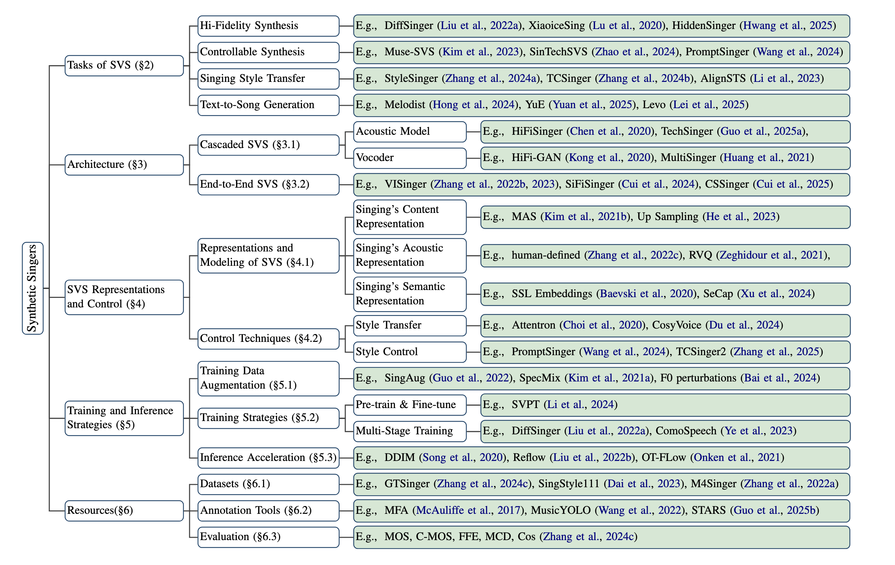
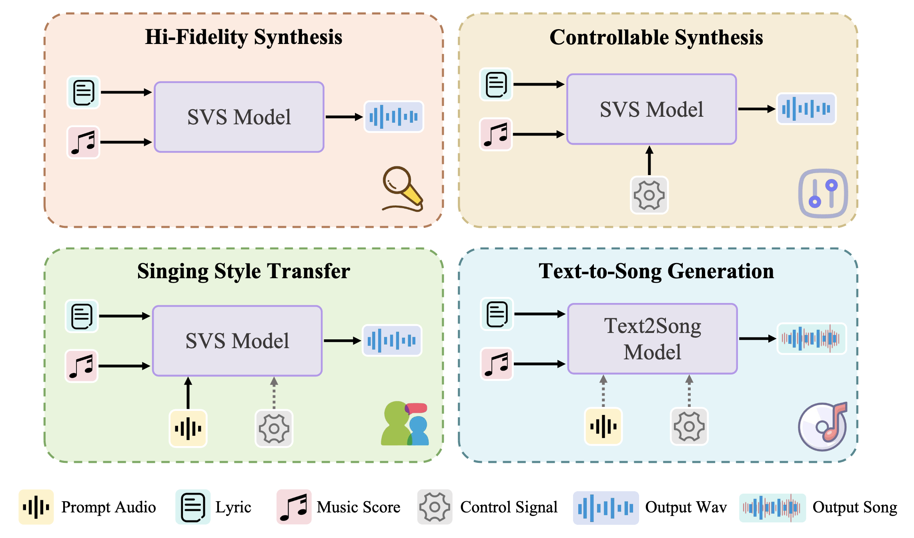
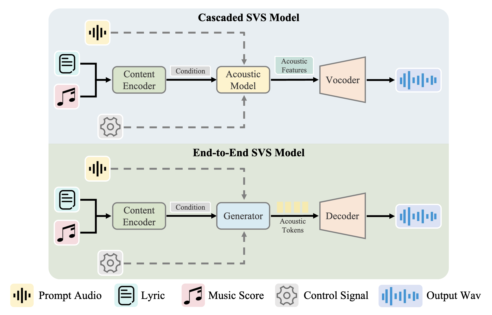

<h2>
Synthetic Singers
    
A Review of Deep-Learning-based Singing Voice Synthesis Approaches
</h2>

This repository contains the resources for paper **Synthetic Singers: A Review of Deep-Learning-based Singing Voice Synthesis Approaches**.

For more details, please refer to the [paper]().

## 🚀 Quick Start

- [Tasks of SVS](#tasks-of-svs)
- [Architectures of SVS Systems](#architectures-of-svs-systems)
- [SVS Representations and Control](#svs-representations-and-control)
- [Resources in SVS Models](#resources-in-svs-models)
  - [Open-Source Datasets](#open-source-datasets)
  - [Annotation Tools for Singing Data](#annotation-tools-for-singing-data)

And the organiztion of this survey is shown below. 

Figure 1: Organization of the survey.

## Tasks of SVS

The mainstream singing voice tasks can be broadly categorized into the following four types:

* **Hi-Fidelity Synthesis:** Focuses on generating high-quality singing voices, with emphasis on clear articulation, natural prosody, and accurate pitch rendering.
* **Controllable Synthesis:** Aims to maintain synthesis quality while enabling fine-grained control over attributes such as timbre, style, and vocal techniques.
* **Singing Style Transfer:** Given a reference singing prompt, the goal is to generate a synthetic voice that closely matches the reference in terms of timbre, style, and expression.
* **Text-to-Song Generation:** Targets the joint generation of high-quality singing voices and their aligned accompaniment, producing a complete musical piece from text input.

Figure 2: An overall demonstration of four prevailing tasks of SYS sytem.

## Architectures of SVS Systems

We categorize current SVS systems into two types based on whether a vocoder is explicitly used in the synthesis pipeline: (a) **Cascaded SVS Models** and (b) **End-to-End SVS Models**.

Figure 3: We categorize SVS models into two paradigms, cascaded and end-to-end approaches, based on whether the
model can directly generate the waveform without the use of vocoder. Dashed lines represent optional processes.

## Publicly Available Singing Voice Synthesis Models

<table>
    <thead>
        <tr>
            <th>Model</th>
            <th>URL</th>
        </tr>
    </thead>
    <tbody>
        <tr>
            <td>XiaoiceSing</td>
            <td><a href="https://github.com/AIGC-Audio/AudioGPT">https://github.com/AIGC-Audio/AudioGPT</a></td>
        </tr>
        <tr>
            <td>SpeechGPT</td>
            <td><a href="https://github.com/0nutation/SpeechGPT">https://github.com/0nutation/SpeechGPT</a></td>
        </tr>
        <tr>
            <td>Freeze-Omni</td>
            <td><a href="https://github.com/VITA-MLLM/Freeze-Omni">https://github.com/VITA-MLLM/Freeze-Omni</a></td>
        </tr>
        <tr>
            <td>Baichuan-Omni</td>
            <td><a href="https://github.com/westlake-baichuan-mllm/bc-omni">https://github.com/westlake-baichuan-mllm/bc-omni</a></td>
        </tr>
        <tr>
            <td>GLM-4-Voice</td>
            <td><a href="https://github.com/THUDM/GLM-4-Voice">https://github.com/THUDM/GLM-4-Voice</a></td>
        </tr>
        <tr>
            <td>Mini-Omni</td>
            <td><a href="https://github.com/gpt-omni/mini-omni">https://github.com/gpt-omni/mini-omni</a></td>
        </tr>
        <tr>
            <td>Mini-Omni2</td>
            <td><a href="https://github.com/gpt-omni/mini-omni2">https://github.com/gpt-omni/mini-omni2</a></td>
        </tr>
        <tr>
            <td>FunAudioLLM</td>
            <td><a href="https://github.com/FunAudioLLM">https://github.com/FunAudioLLM</a></td>
        </tr>
       <tr>
            <td>Qwen-Audio</td>
            <td><a href="https://github.com/QwenLM/Qwen-Audio">https://github.com/QwenLM/Qwen-Audio</a></td>
        </tr>
        <tr>
            <td>Qwen2-Audio</td>
            <td><a href="https://github.com/QwenLM/Qwen2-Audio">https://github.com/QwenLM/Qwen2-Audio</a></td>
        </tr>
        <tr>
            <td>LLaMA3.1</td>
            <td><a href="https://www.llama.com">https://www.llama.com</a></td>
        </tr>
        <tr>
            <td>Audio Flamingo</td>
            <td><a href="https://github.com/NVIDIA/audio-flamingo">https://github.com/NVIDIA/audio-flamingo</a></td>
        </tr>
       <tr>
            <td>Ultravox</td>
            <td><a href="https://github.com/fixie-ai/ultravox">https://github.com/fixie-ai/ultravox</a></td>
        </tr>
        <tr>
            <td>Spirit LM</td>
            <td><a href="https://github.com/facebookresearch/spiritlm">https://github.com/facebookresearch/spiritlm</a></td>
        </tr>
        <tr>
            <td>dGSLM</td>
            <td><a href="https://github.com/facebookresearch/fairseq/tree/main/examples/textless_nlp/dgslm">https://github.com/facebookresearch/fairseq/tree/main/examples/textless_nlp/dgslm</a></td>
        </tr>
        <tr>
            <td>Spoken-LLM</td>
            <td><a href="https://arxiv.org/abs/2305.11000">https://arxiv.org/abs/2305.11000</a></td>
        </tr>
        <tr>
            <td>LLaMA-Omni</td>
            <td><a href="https://github.com/ictnlp/LLaMA-Omni">https://github.com/ictnlp/LLaMA-Omni</a></td>
        </tr>
        <tr>
            <td>Moshi</td>
            <td><a href="https://github.com/kyutai-labs/moshi">https://github.com/kyutai-labs/moshi</a></td>
        </tr>
        <tr>
            <td>SALMONN</td>
            <td><a href="https://github.com/bytedance/SALMONN">https://github.com/bytedance/SALMONN</a></td>
        </tr>
        <tr>
            <td>LTU-AS</td>
            <td><a href="https://github.com/YuanGongND/ltu">https://github.com/YuanGongND/ltu</a></td>
        </tr>
        <tr>
            <td>VITA</td>
            <td><a href="https://github.com/VITA-MLLM/VITA">https://github.com/VITA-MLLM/VITA</a></td>
        </tr>
        <tr>
            <td>SpeechGPT-Gen</td>
            <td><a href="https://github.com/0nutation/SpeechGPT">https://github.com/0nutation/SpeechGPT</a></td>
        </tr>
       <tr>
            <td>WavLLM</td>
            <td><a href="https://github.com/microsoft/SpeechT5/tree/main/WavLLM">https://github.com/microsoft/SpeechT5/tree/main/WavLLM</a></td>
        </tr>
        <tr>
            <td>Westlake-Omni</td>
            <td><a href="https://github.com/xinchen-ai/Westlake-Omni">https://github.com/xinchen-ai/Westlake-Omni</a></td>
        </tr>
        <tr>
            <td>MooER-Omni</td>
            <td><a href="https://github.com/MooreThreads/MooER">https://github.com/MooreThreads/MooER</a></td>
        </tr>
        <tr>
            <td>Hertz-dev</td>
            <td><a href="https://github.com/Standard-Intelligence/hertz-dev">https://github.com/Standard-Intelligence/hertz-dev</a></td>
        </tr>
        <tr>
            <td>Fish-Agent</td>
            <td><a href="https://github.com/fishaudio/fish-speech">https://github.com/fishaudio/fish-speech</a></td>
        </tr>
        <tr>
            <td>SpeechGPT2</td>
            <td><a href="https://0nutation.github.io/SpeechGPT2.github.io/">https://0nutation.github.io/SpeechGPT2.github.io/</a></td>
        </tr>
    </tbody>
</table>

Table 1: The list of publicly available speech dialogue models and their URL

## SVS Representations and Control

## Resources in SVS Models

### Open-Source Datasets

| name | paper | year | link |
|--------------------|---------------------------------------------------------------------------------------------------------------------------|------|------------------------------------------------------------------------------|
| MIR-1K             | On the Improvement of Singing Voice Separation for Monaural Recordings Using the MIR-1K Dataset                           | 2009 |                                                                              |
| NUS-48E            | The NUS Sung and Spoken Lyrics Corpus:A Quantitative Comparison of Singing and Speech                                     | 2013 |                                                                              |
| VocalSet           | VocalSet: A Singing Voice Dataset                                                                                         | 2018 | https://zenodo.org/records/1203819                                           |
| KVT                | Semantic Tagging of Singing Voices in Popular Music Recordings                                                            | 2020 |                                                                              |
| CSD                | Children's Song Dataset for Singing Voice Research                                                                        | 2020 | https://zenodo.org/record/4785016#.YLYW6P0QtTa                               |
| PJS                | PJS: phoneme-balanced Japanese singing voice corpus                                                                       | 2020 | https://sites.google.com/site/shinnosuketakamichi/research-topics/pjs_corpus |
| NHSS               | NHSS: A Speech and Singing Parallel Database                                                                              | 2021 | https://hltnus.github.io/NHSSDatabase/download.html                          |
| OpenSinger         | Multi-Singer: Fast Multi-Singer Singing Voice Vocoder With A Large-Scale Corpus                                           | 2021 | https://multi-singer.github.io/                                              |
| Tohoku Kiritan     | Tohoku Kiritan singing database: A singing database for statistical parametric singing synthesis using Japanese pop songs | 2021 | https://zunko.jp/kiridev/login.php                                           |
| PopCS              | DiffSinger: Singing Voice Synthesis via Shallow Diffusion Mechanism                                                       | 2022 |                                                                              |
| M4Singer           | M4Singer: a Multi-Style, Multi-Singer and Musical Score Provided Mandarin Singing Corpus                                  | 2022 | https://github.com/M4Singer/M4Singer                                         |
| PopBuTFy           | Learning the Beauty in Songs: Neural Singing Voice Beautifier                                                             | 2022 | https://github.com/MoonInTheRiver/NeuralSVB                                  |
| Opencpop           | Opencpop: A High-Quality Open Source Chinese Popular Song Corpus for Singing Voice Synthesis                              | 2022 | https://wenet.org.cn/opencpop/                                               |
| Annotated-VocalSet | Annotated-VocalSet: A Singing Voice Dataset                                                                               | 2022 | https://zenodo.org/records/7061507                                           |
| SingStyle111       | SINGSTYLE111: A MULTILINGUAL SINGING DATASET WITH STYLE TRANSFER                                                          | 2023 |                                                                              |
| GTSinger           | GTSinger: A Global Multi-Technique Singing Corpus with Realistic Music Scores for All Singing Tasks                       | 2024 | https://huggingface.co/datasets/GTSinger/GTSinger                            |
| AceSinger          | Singing Voice Data Scaling-up: An Introduction to ACE-Opencpop and ACE-KiSing                                             | 2024 | https://github.com/espnet/espnet                                             |

### Annotation Tools for Singing Data

| name | usage | link |
|---|--|---|---|
| MFA | Speech-Text Forced Alignment | |
